<!-- amuzetnoM/amuzetnoM — profile README -->
<!-- Last updated: 2026-02-14 -->
<!-- Structure: Update repos in the tables below. Diagram nodes mirror the table sections. -->

## How It Connects

```mermaid
graph TB
    %% ── Research Layer ──
    R["🔬 Research\nConsciousness · Spacetime · Uncertainty"]
    
    %% ── Core Engine Layer ──
    H["⚡ Hektor\nVector Engine (C++)"]
    SDK["🧰 ARTIFACT-SDK\nML · Blockchain · Web3"]
    
    %% ── Intelligence Layer ──
    GLAD["GLADIUS\nRecursive Self-Improving AI"]
    MAOS["MAOS\nMulti-Agent Orchestration"]
    LEGION["LEGION\nAutonomous Research Org"]
    REASON["REASON\nTheorem Proving · Consensus"]
    CREW["CREWos\nAI Engineering Runtime"]
    EVE["EVE\nMultiplayer AI Coding"]
    
    %% ── Security Layer ──
    SENT["🛡 SENTINEL\nCybersecurity Framework"]
    QS["QShield\nPost-Quantum Encryption"]
    COMMON["COMMONprotocol\nLLM-to-LLM Comms"]
    
    %% ── Blockchain Layer ──
    ARC["⛓ ARC\nDeFi · Governance · Constitution"]
    ADAM["ADAM\nOnchain AI Agents"]
    FC["foundry-courier\nValue Transfer Without Internet"]
    
    %% ── Enterprise Layer ──
    OMEGA["Ω Enterprise\nOperating System"]
    
    %% ── Application Layer ──
    APPS["📡 Applications\nIDEs · Editors · Interfaces"]
    TRADE["📊 Trading\nSyndicate · Exodus · Backtester"]
    INFRA["🏗 Infrastructure\nGPTLab · ULTRAcore · HYBRIDbee"]
    
    %% ── Connections ──
    R -->|"informs"| H
    R -->|"theory → system"| GLAD
    H -->|"powers"| SDK
    SDK -->|"toolkit for"| GLAD
    SDK -->|"toolkit for"| ARC
    
    GLAD --> MAOS
    GLAD --> LEGION
    MAOS --> CREW
    MAOS --> EVE
    LEGION --> REASON
    
    SENT --> OMEGA
    QS --> ARC
    COMMON --> MAOS
    
    ARC --> ADAM
    ADAM --> FC
    
    GLAD --> OMEGA
    MAOS --> OMEGA
    SENT --> ARC
    
    OMEGA --> APPS
    OMEGA --> TRADE
    OMEGA --> INFRA
    
    %% ── Styling ──
    classDef research fill:#1a1a2e,stroke:#e94560,color:#eee
    classDef engine fill:#16213e,stroke:#0f3460,color:#eee
    classDef intel fill:#0f3460,stroke:#533483,color:#eee
    classDef security fill:#1a1a2e,stroke:#e94560,color:#eee
    classDef chain fill:#162447,stroke:#1f4068,color:#eee
    classDef enterprise fill:#1b1b2f,stroke:#e43f5a,color:#eee
    classDef apps fill:#162447,stroke:#1f4068,color:#eee
    
    class R research
    class H,SDK engine
    class GLAD,MAOS,LEGION,REASON,CREW,EVE intel
    class SENT,QS,COMMON security
    class ARC,ADAM,FC chain
    class OMEGA enterprise
    class APPS,TRADE,INFRA apps
```

 

> *Building systems that understand, secure, and decentralize — because the future is in our hands. Literally.*

---

### 🔬 Research

Where everything starts. Theoretical frameworks that feed into every system below.

| Repository | What It Does |
|:-----------|:-------------|
| [`research`](https://github.com/amuzetnoM/research) | Consciousness theory, self-awareness mechanics, quantum spacetime, emotional dimensionality, probabilistic uncertainty principle, `lifeform.c` (bare-metal C consciousness), memory/thought chains |
| [`orxl`](https://github.com/amuzetnoM/orxl) | Modular prediction system built on universal argmax equation |

### ⚡ Core Engines

The foundational technology the rest of the stack is built on.

| Repository | What It Does | Lang |
|:-----------|:-------------|:-----|
| [`hektor`](https://github.com/amuzetnoM/hektor) | High-performance vector engine for semantic search and AI training | C++ |
| [`ARTIFACT-SDK`](https://github.com/amuzetnoM/ARTIFACT-SDK) | Modular ML/AI, blockchain, and web3 development workspace | Python |
| [`enterprise`](https://github.com/amuzetnoM) | **Artifact: Omega** — the enterprise operating system | Private |

### 🧠 Intelligence Systems

under [Artifact-Virtual](https://github.com/Artifact-Virtual)

| Repository | What It Does |
|:-----------|:-------------|
| [`GLADIUS`](https://github.com/Artifact-Virtual) | Native AI enterprise system with recursive self-improvement |
| [`MAOS`](https://github.com/Artifact-Virtual/MAOS) | Multi-Agent Orchestration System |
| [`LEGION`](https://github.com/Artifact-Virtual/LEGION) | Autonomous Research Organization |
| [`REASON`](https://github.com/Artifact-Virtual/REASON) | Autonomous theorem proving and consensus engine |
| [`CREWos`](https://github.com/Artifact-Virtual/CREWos) | Autonomous AI engineering runtime |
| [`EVE`](https://github.com/Artifact-Virtual/EVE) | Multiplayer AI coding assistant (Go) |
| [`cthulu`](https://github.com/amuzetnoM/cthulu) | AI system with remote monitoring |
| [`GPTLab`](https://github.com/Artifact-Virtual/GPTLab) | GPU-first tensor modelling, training, and fine-tuning |
| [`AGENTfoundry`](https://github.com/Artifact-Virtual/AGENTfoundry) | Prompt-to-product code generation |

### 🛡 Security

| Repository | What It Does |
|:-----------|:-------------|
| [`SENTINEL`](https://github.com/Artifact-Virtual/SENTINEL) | AI-powered cybersecurity framework, multi-platform |
| [`QShield`](https://github.com/Artifact-Virtual/QShield) | Self-healing encryption with post-quantum KEM |
| [`COMMONprotocol`](https://github.com/Artifact-Virtual/COMMONprotocol) | Secure LLM-to-LLM communication protocol |
| [`flex_audit`](https://github.com/amuzetnoM/flex_audit) | Self-guiding static code auditor with SARIF output |

### ⛓ Blockchain & DeFi

| Repository | What It Does | Lang |
|:-----------|:-------------|:-----|
| [`ARC`](https://github.com/Artifact-Virtual/ARC) | DeFi & governance protocol with deterministic constitutional engine | Solidity |
| [`ADAM`](https://github.com/Artifact-Virtual/ADAM) | Onchain AI agents framework | Python |
| [`ARC_simulation`](https://github.com/Artifact-Virtual/ARC_simulation) | ARC/ADAM Protocol simulation environment | Python |
| [`foundry-courier`](https://github.com/Artifact-Virtual/foundry-courier) | Extreme resilience — move value without internet | Python |
| [`PROJECT-OUTCOME`](https://github.com/Artifact-Virtual/PROJECT-OUTCOME) | Post-apocalyptic web3 social gaming | TypeScript |
| [`METEORide`](https://github.com/Artifact-Virtual/METEORide) | Unified blockchain IDE | TypeScript |

### 📊 Trading & Quantitative Systems

| Repository | What It Does | Lang |
|:-----------|:-------------|:-----|
| [`syndicate`](https://github.com/amuzetnoM/syndicate) | Quantitative analysis + multi-provider LLM for market alpha | Python |
| [`exodus`](https://github.com/amuzetnoM/exodus) | Broker integration and order-routing platform | Python |
| [`backtester`](https://github.com/amuzetnoM/backtester) | HFT backtesting harness | TypeScript |

### 🏗 Infrastructure & Developer Tools

| Repository | What It Does | Lang |
|:-----------|:-------------|:-----|
| [`ULTRAcore`](https://github.com/Artifact-Virtual/ULTRAcore) | Full-stack VM deployment for AI workloads | Shell |
| [`HYBRIDbee`](https://github.com/Artifact-Virtual/HYBRIDbee) | Smart serverless schema-on-read database | Python |
| [`GOALKEEPER`](https://github.com/Artifact-Virtual/GOALKEEPER) | Automated API discovery | Python |
| [`code-workspace`](https://github.com/Artifact-Virtual/code-workspace) | Intelligent VS Code workspace automation | Python |
| [`gh_projects`](https://github.com/amuzetnoM/gh_projects) | GitHub Projects V2 integration | TypeScript |
| [`odus`](https://github.com/amuzetnoM/odus) | AI-powered project management | TypeScript |
| [`super_scripts`](https://github.com/amuzetnoM/super_scripts) | Operational and security scripts | Shell |
| [`hardware_scan`](https://github.com/amuzetnoM/hardware_scan) | Cross-platform hardware detection | Shell |
| [`rpi-ngnix`](https://github.com/Artifact-Virtual/rpi-ngnix) | Reverse proxy with security monitoring + AI | Python |
| [`satx`](https://github.com/Artifact-Virtual/satx) | Automated satellite detection and decoding | Python |

### 📡 Applications & Interfaces

| Repository | What It Does | Lang |
|:-----------|:-------------|:-----|
| [`PHANTOMui`](https://github.com/Artifact-Virtual/PHANTOMui) | Universal language model desktop driver | HTML |
| [`TMPL8`](https://github.com/Artifact-Virtual/TMPL8) | Universal chat interface for any LLM backend | HTML |
| [`METEORmde`](https://github.com/Artifact-Virtual/METEORmde) | Markdown editor with intelligence + collaboration | TypeScript |
| [`VADE`](https://github.com/Artifact-Virtual/VADE) | Live chat-to-webpage code editor | TypeScript |
| [`adopt`](https://github.com/amuzetnoM/adopt) | Zoneless SPA for automated advertising lifecycle | TypeScript |
| [`ai-discord-bot`](https://github.com/Artifact-Virtual/ai-discord-bot) | AI moderator bot (Tinyllama) | Python |

---

<b>Full Ecosystem Count</b>

| | Public | Private | Total |
|:---|:---:|:---:|:---:|
| [amuzetnoM](https://github.com/amuzetnoM) | 18 | 18 | 36 |
| [Artifact-Virtual](https://github.com/Artifact-Virtual) | 30 | 4 | 34 |
| **Total** | **48** | **22** | **70** |

Languages: Python · TypeScript · C++ · Go · Solidity · Shell · HTML

<b>How to Navigate This</b>

The diagram at the top maps the dependency flow:

- **Research** produces the theoretical frameworks
- **Core Engines** (Hektor, SDK) turn theory into usable infrastructure
- **Intelligence Systems** build on the engines to create autonomous agents and orchestration
- **Security** protects everything — the AI systems, the blockchain protocols, the enterprise stack
- **Blockchain & DeFi** applies the intelligence and security layers to decentralized systems
- **Enterprise** (Omega) integrates it all into a single operating system
- **Applications, Trading, and Infrastructure** are the user-facing outputs

Everything flows down from research and fans out into applied systems. Adding a new project means placing it in the right layer and connecting it to what it depends on.

---

Artifact Virtual (SMC-Private) Limited · [Artifact-Virtual](https://github.com/Artifact-Virtual)
